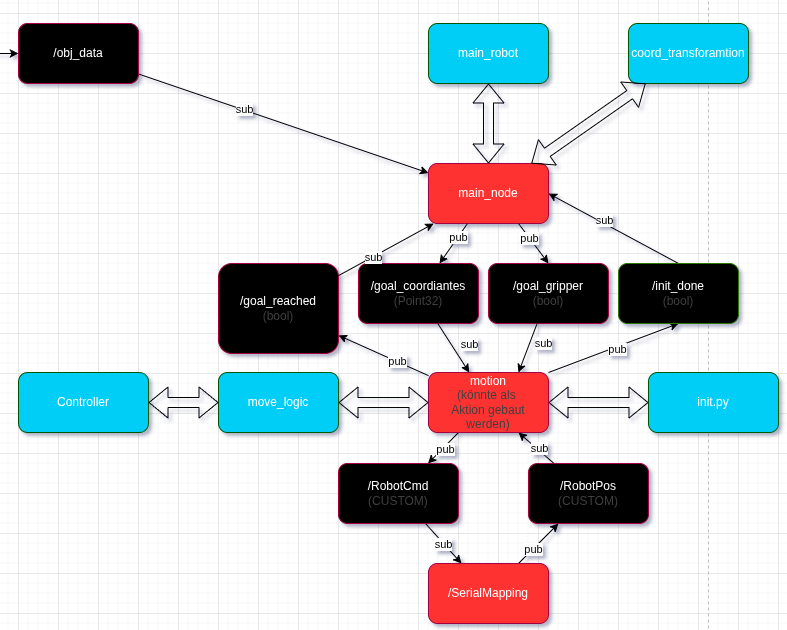

# TODO 

- Greifer Logic umsetzten [Prio: TEST]

- PHYSISCH AUF Defaultpunkt fahren [DONE]
- Regler optimieren [DONE]
- Problem mit Y_Achse verfahren beheben [DONE]
- DocStrings im Code erweitern [DONE]

---
---

# Regler auslegung zum Ansteuern der Motoren des Portalroboters

Regler als Funktion in eigener Klasse ausgelagert:

**class Controller()**

Mitzugebende Variablen beim Instanzieren:
- kp (Wert für den Proportional Anteil)
- kd (Wert für den derivativ-Anteil)

**def compute()**

Mitzugebende Variablen beim Instanzieren:
- goal_pos (zielposition, von mainy)
- curr_pos (aktuelle Position, von /RoboPos)
- delta_t (Zeitabstand zwischen den letzten Zwei Positionen)

**Zurückgegebener Wert:**
- beschleunigung

#  Motion Node

## Motion-Block Komponente: Aufbau und Grundlegender Ablauf

> Nach Start des Systems wird automatisch die Initialisierung durchgeführt und eine init-flag = true gesetzt.

> Der Arbeitstakt wird durch eingehende RoboterPositionsdaten vorgegeben. 

> Werden Zielkoordinaten über /goal_coordinates empfangen, regelt der Motion-Block so lange, bis das Ziel erreicht ist oder darüber gehovert wird. 

## Schnittstellen

**Subscription Topics**

- "/goal_coordiantes" (Point32) -> Empfängt Zielkoordinaten
- "/goal_gripper" (bool)        -> Empfängt Greifer zustand (offen/geschlossen)
- "/RobotPos" (x,y,z)      -> Empfängt die aktuellen Roboterpositionsdaten (~10Hz)

**Publisher Topics**

- "/goal_reached" (bool)        -> Übergibt Info, wenn Zielkoordinaten erreicht wurden
- "/init_done" (bool)           -> Übergibt Info, wenn Initphase abgeschlossen ist
- "/RobotCmd" (x,y,z,bool)      -> Übergibt Beschleunigungswerte & soll_greiferzustand

## Module 

- "Motio.py"      -> ROS2 Node, Zentrale Datei für Motion-Block
- "init.py"       -> Python Logic für die Initphase
- "move_logic.py" -> Pyhton Logic für die Hauptbewegung
- "controller.py" -> Pyhton Logic für den Regler (abstrakt gehalten)  

---

---